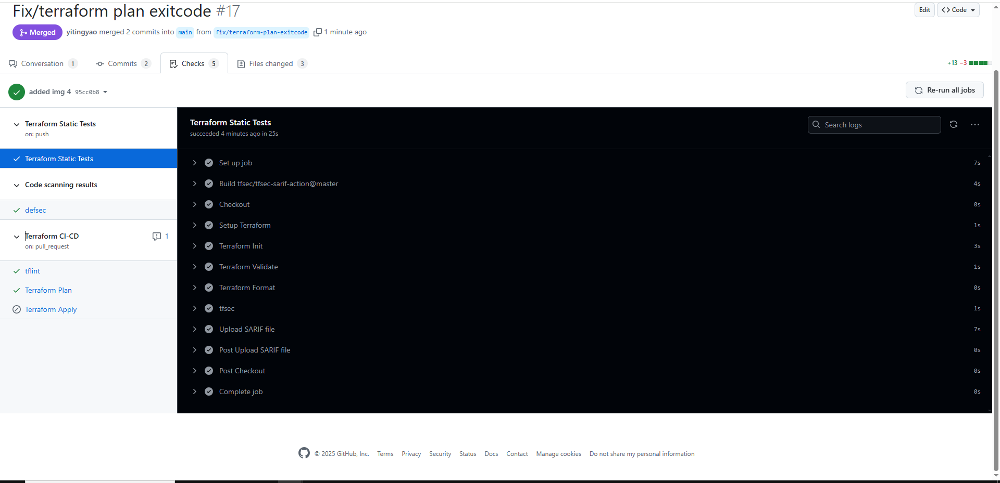
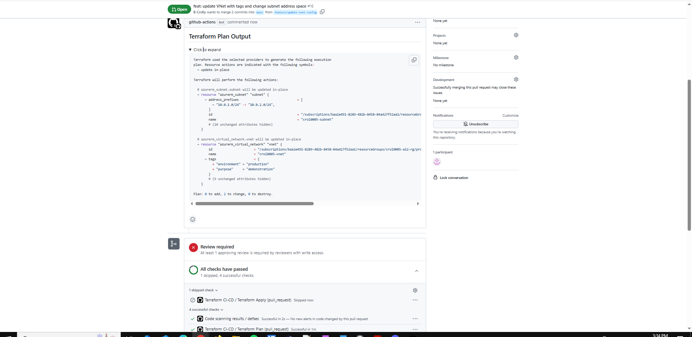
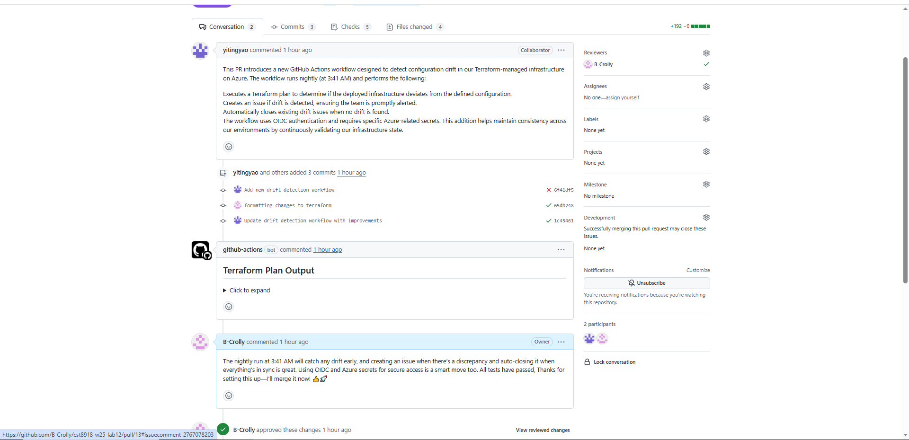
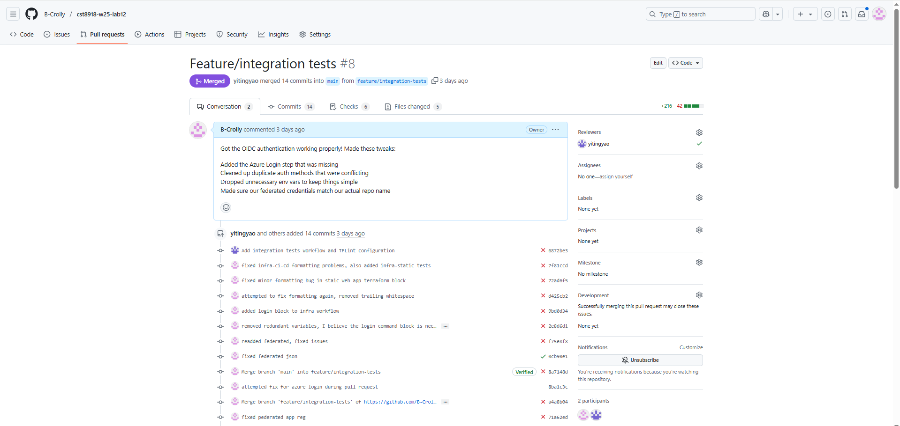
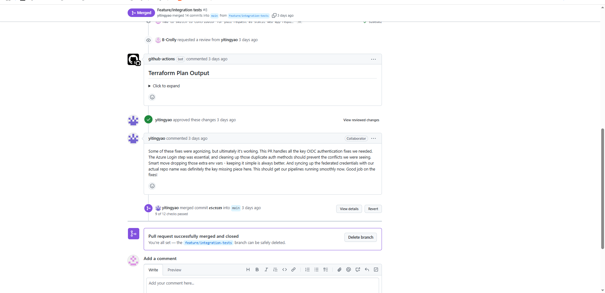
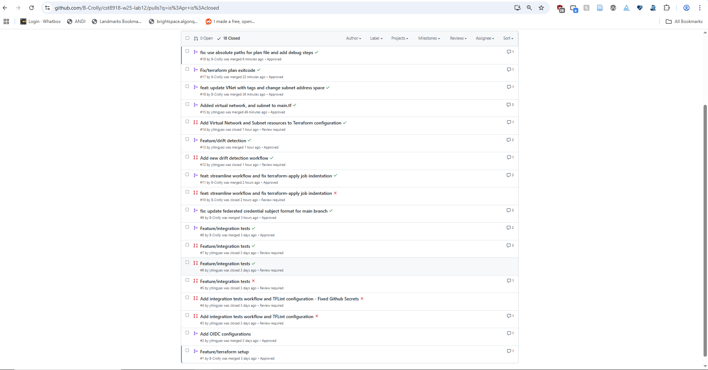

# cst8918-w25-lab12

Repository for CST8918 Lab 12: Terraform CI/CD on Azure with GitHub Actions 

setting up branch protection

protection rules for production, require non-self review and main only

all checks passing as expected

terraform plan output after vnet changes

examples of our insightful and well thought out comments!

Terraform apply succeeding after pushing changed config to main

please enjoy our PR history (god we made so many mistakes)

